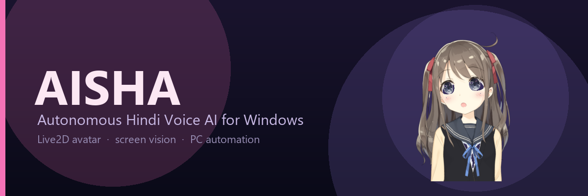
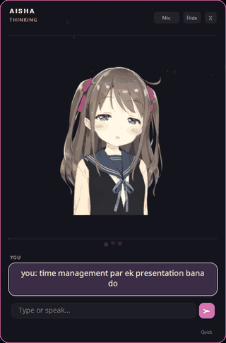

<p align="center">
  
</p>

<h1 align="center">Aisha AI</h1>

<p align="center">
  <strong>Autonomous Hindi voice assistant for Windows — screen vision, anime avatar, PC automation & web research</strong><br>
  Hands-free · Lip-sync avatar · See & verify · Multi-app chains · Persistent memory
</p>

<p align="center">
  <a href="https://github.com/thor8126/Aisha-AI/stargazers">
    
  </a>
  
  
  
  <a href="https://github.com/thor8126/Aisha-AI/blob/main/CONTRIBUTING.md">
    
  </a>
</p>

---

<p align="center">
  <a href="#what-is-aisha"><strong>What is Aisha?</strong></a> ·
  <a href="#key-features"><strong>Features</strong></a> ·
  <a href="#quick-start"><strong>Quick Start</strong></a> ·
  <a href="#voice-commands"><strong>Commands</strong></a> ·
  <a href="#contributing"><strong>Contributing</strong></a>
</p>

---

<p align="center">
  
  <br>
  <sub><em>Voice command → Aisha researches, builds a presentation, and plays a song — with a live Live2D avatar.</em></sub>
</p>

---

## What is Aisha?

**Aisha AI is a free, open-source AI voice assistant for Windows** — a Jarvis-style autonomous agent that lives on your desktop. She speaks natural Hindi and English (Hinglish), controls your PC with a screen-aware LLM brain, remembers your preferences across sessions, and runs silently in the background — always ready when you say *"Hey Aisha"*.

Unlike a chatbot, Aisha is a **real AI companion and desktop agent**: she opens apps, searches the web, creates Word documents and PowerPoint presentations, manages files, sends WhatsApp messages, reads what's on your screen with AI vision, plays music, and drives the browser autonomously — all with a voice, a personality, and an animated **Live2D anime avatar** that lip-syncs to her speech.

> **Looking for an open-source Jarvis / AI desktop assistant / voice-controlled PC agent for Windows?** That's exactly what Aisha is.

## Key Features

### 🎙️ Voice & Conversation
| Feature | Details |
|:---|:---|
| **Hands-free wake words** | "Hey Aisha", "Suno", "Aisha", "Oye", "Bolo" and more — just speak to wake her |
| **Barge-in interruption** | Speak over Aisha to stop playback instantly and issue a new command |
| **Natural Hindi/Hinglish voice** | ElevenLabs v3 with tuned voice presets for every emotion and task type |
| **Offline fallback TTS** | Falls back to Windows SAPI5 when ElevenLabs is unavailable |

### 🖥️ Screen Vision & Autonomous Control
| Feature | Details |
|:---|:---|
| **Real screen vision** | Aisha actually *sees* your screen using a vision-capable AI model — she reads text, chats, errors, and buttons |
| **See → Act → Verify loop** | After every UI action she checks the screen result and self-corrects if something went wrong |
| **Autonomous browser chains** | Tell her to "research X and make a doc" — she searches, reads pages, writes the document, opens it, all on her own |
| **20+ PC automation tools** | Mouse, keyboard, apps, files, web, shell, clipboard, tasks, reminders, and more |

### 🎨 Animated Avatar
| Feature | Details |
|:---|:---|
| **Lip-sync anime avatar** | Beautiful anime girl whose mouth moves in sync with her actual voice |
| **Blinking & idle motion** | Natural blinking, gentle breathing, subtle sway when idle |
| **Expression changes** | Her face changes with her state — listening, thinking, happy, empathetic |
| **Customizable** | Drop your own anime sprite PNGs into `assets/avatar/` — the engine picks them up instantly |

### 🧠 Smart AI Brain
| Feature | Details |
|:---|:---|
| **Dual-model routing** | Fast model for simple tasks (open app, set timer), strong model for research, writing, and complex chains — no wasted compute |
| **Multi-step reasoning** | Plans and executes multi-app workflows end-to-end: research → document → presentation |
| **Web research** | Searches the internet AND reads the top pages for grounded, factual answers |
| **Persistent memory** | Remembers your name, preferences, and conversation context across sessions |

### 🔧 Built for Windows
| Feature | Details |
|:---|:---|
| **Floating HUD** | Minimal translucent overlay with animated waveform and live activity feed |
| **Global hotkey** | `Ctrl + Shift + A` works even inside fullscreen games |
| **Auto-start** | Launch on Windows boot, runs silently in the background |
| **Crash recovery** | Watchdog auto-restarts Aisha if she crashes — stays alive 24/7 |

---

## Quick Start

There are two ways to run Aisha: **download the ready-made app** (easiest) or **run from source** (for developers).

### Option A — Download the app (no Python needed)

1. Go to the [**Releases page**](https://github.com/thor8126/Aisha-AI/releases) and download the latest `Aisha-AI-windows.zip`.
2. Unzip it anywhere and run **`Aisha.exe`**.
3. On first launch, Aisha creates a `.env` settings file next to the exe and opens it for you. **Paste your API key** into `TOKEN="..."` (get a free one at [groq.com](https://groq.com)), save, and relaunch.
4. That's it — she calibrates your mic, greets you, and starts listening.

> The app auto-updates: when a new release is published, Aisha offers to update from the tray menu.

### Option B — Run from source

**Prerequisites:** Windows 10/11 (64-bit), [Python 3.10+](https://www.python.org/downloads/windows/) (check *"Add python.exe to PATH"*), a microphone.

```bash
# 1. Clone
git clone https://github.com/thor8126/Aisha-AI.git
cd Aisha-AI

# 2. Install dependencies
pip install -r requirements.txt
pip install PyQt6-WebEngine python-pptx python-docx openpyxl

# 3. Configure your API keys
copy .env.example .env      # then edit .env — see Configuration below

# 4. Launch
python run.py               # or:  python -m aisha  (with src on PYTHONPATH)
```

Aisha will calibrate your mic, greet you, and start listening.

**Other launch modes:**

```bash
python run.py --text        # keyboard chat, no mic/voice
python run.py --cli         # voice in the terminal, no overlay
python run.py --ask "kya time hua hai"   # one-shot question, then exit
```

### Health Check

```bash
python -m aisha.system.doctor   # or: python run.py then check logs/aisha.log
```

---

## Configuration

### `.env` File

All settings and API keys live in a `.env` file.

- **From source:** copy `.env.example` to `.env` and edit it.
- **From the packaged app:** Aisha creates a `.env` next to `Aisha.exe` on first launch and opens it for you — just paste your key and relaunch. The app always reads the `.env` sitting beside the executable, so it works no matter where you launched it from.

```bash
copy .env.example .env       # from source
# Then edit .env with your favorite text editor
```

> **Never commit `.env` to version control** — it contains your API keys. It's already in `.gitignore`. (Optionally, store keys in Windows Credential Manager via `python -m aisha.system.secure_keys store` and keep `.env` empty of secrets.)

### AI Providers

Aisha uses a **three-tier AI routing system**: fast model for simple tasks, strong model for research/writing, and automatic failover if any provider is down.

#### 1. Primary AI Provider (Required)

This handles most requests — app opens, quick questions, timers, simple tasks.

| Variable | Description | Default |
|:---|:---|:---|
| `BASE_URL` | Your AI provider's API endpoint | `https://api.groq.com/openai/v1` |
| `TOKEN` | Your API key for the primary provider | (empty — must fill in) |
| `AISHA_PRIMARY_MODEL` | Model name to use | `openai/gpt-oss-20b` |
| `AISHA_MODEL_CASCADE` | Comma-separated fallback models | `openai/gpt-oss-20b,openai/gpt-oss-120b,openai/` |
| `AISHA_MAX_TOKENS` | Max response tokens | `1600` |
| `AISHA_MAX_STEPS` | Max tool-call steps per request | `16` |

**Recommended free primary**: [Groq](https://groq.com/) — ultra-fast (~450ms), generous free tier. Sign up, get your API key, and paste it in `TOKEN`.

#### 2. NVIDIA NIM (Automatic Fallback)

Used automatically when the primary provider is rate-limited or unavailable. No extra configuration needed — just add your key.

| Variable | Description |
|:---|:---|
| `NVIDIA_BASE_URL` | NVIDIA API endpoint (pre-filled) |
| `NVIDIA_API_KEY` | Your free NVIDIA NIM key from [build.nvidia.com](https://build.nvidia.com/) |
| `NVIDIA_MODELS` | Models to try, comma-separated |
| `NVIDIA_MODEL_CASCADE` | Additional fallback models |

#### 3. Bay of Assets (Strong AI — Optional but Recommended)

This is Aisha's **brain for hard tasks** — research, writing essays, creating documents, multi-step browser chains. It uses Claude Opus/Sonnet for the strongest reasoning.

| Variable | Description |
|:---|:---|
| `BAYOFASSETS_BASE_URL` | API endpoint (pre-filled) |
| `BAYOFASSETS_TOKEN` | Your key from [bayofassets.com](https://bayofassets.com) |
| `BAYOFASSETS_MODEL` | Default strong model |
| `BAYOFASSETS_MODELS` | Available models, comma-separated |
| `BAYOFASSETS_VISION_MODEL` | Model for screen vision (reading what's on screen) |

**Without Bay of Assets**: Aisha still works — she just uses the primary + fallback models for everything. Research and writing quality will be lower.

#### 4. AgentRouter (Deep Fallback — Optional)

Used only when both primary and NVIDIA are down. Free tier available.

| Variable | Description |
|:---|:---|
| `AGENTROUTER_BASE_URL` | Endpoint (pre-filled) |
| `AGENTROUTER_TOKEN` | Your free key from [agentrouter.org](https://agentrouter.org/) |
| `AGENTROUTER_MODELS` | Models to try, comma-separated |

### Voice Settings

| Variable | Description | Default |
|:---|:---|:---|
| `ELEVEN_LAB` | ElevenLabs API key for natural Hindi voice | (empty — falls back to Windows TTS) |
| `ELEVENLABS_VOICE_ID` | Voice ID to use | `WUgmmuDCpFXQ4z0NUUYX` (Zara) |
| `ELEVENLABS_MODEL_ID` | ElevenLabs model version | `eleven_v3` |
| `WHISPER_MODEL` | Speech recognition model size | `small` (`tiny`/`base`/`small`/`medium`) |

**Get ElevenLabs**: Sign up at [elevenlabs.io](https://elevenlabs.io/) — free tier includes 10K characters/month. Without a key, Aisha uses Windows SAPI5 TTS (robotic but functional).

### File Output

| Variable | Description | Default |
|:---|:---|:---|
| `AISHA_OUTPUT_DIR` | Where documents, presentations, and spreadsheets are saved | `E:\AishaFiles` |

All files Aisha creates (Word docs, PowerPoint decks, Excel sheets) go here. She knows this path and will open files from it when you say "the word file" or "wo essay".

### Email Settings (Optional)

For the `send_email` tool:

| Variable | Description | Default |
|:---|:---|:---|
| `EMAIL_USER` | Your email address | (empty) |
| `EMAIL_PASSWORD` | Your email password or app-specific password | (empty) |
| `EMAIL_SMTP_HOST` | SMTP server host | `smtp.gmail.com` |
| `EMAIL_SMTP_PORT` | SMTP server port | `587` |

**Gmail users**: Use an [App Password](https://myaccount.google.com/apppasswords), not your regular password.

### Advanced Settings

| Variable | Description | Default |
|:---|:---|:---|
| `AISHA_DATA_DIR` | Where tasks, notes, reminders are stored | `.assistant_data` |
| `AISHA_API_TYPE` | Force API client type (`openai` or `anthropic`) | auto-detected |
| `AISHA_IDLE_TIMEOUT` | Seconds of silence before the active session sleeps | `30` |

---

## Where to Get API Keys

| Service | Purpose | Free Tier | Link |
|:---|:---|:---|:---|
| **Groq** | Primary AI brain (fast) | Yes — very generous | [groq.com](https://groq.com/) |
| **NVIDIA NIM** | Automatic fallback AI | Yes | [build.nvidia.com](https://build.nvidia.com/) |
| **Bay of Assets** | Strong AI for research & writing | Check their plan | [bayofassets.com](https://bayofassets.com) |
| **AgentRouter** | Deep fallback AI | Yes | [agentrouter.org](https://agentrouter.org/) |
| **ElevenLabs** | Natural Hindi voice | 10K chars/month | [elevenlabs.io](https://elevenlabs.io/) |

---

## Voice Commands

Aisha understands **natural Hindi, Hinglish, and English**. Just speak naturally:

### Wake Words

> "Hey Aisha" · "Suno" · "Aisha" · "Arre" · "Batao" · "Oye" · "Hello" · "Bolo"

### Example Requests

```
🔍  "Latest AI news search karo"
📂  "E:\AishaFiles mein saari files dikhao"
📝  "Climate change par 500 word essay likho"
⏰  "Kal subah 9 baje reminder lagao"
🌐  "Chrome kholo aur python.org pe jao"
💻  "Best budget phone kaunsa hai research karke batao"
📊  "Time management par presentation bana do — 3 slides"
📋  "Mera clipboard padh kar summarize karo"
🎵  "Spotify play karo"
📸  "Screenshot le lo"
💬  "WhatsApp kholo aur Virender ko message bhejo — hi bol"
```

### What She Can Do

| Category | Examples |
|:---|:---|
| **Apps & System** | Open/close any app, volume, brightness, shutdown, lock screen |
| **Files** | Search, open, create, edit, organize files and folders |
| **Documents** | Create Word docs, Excel sheets, PowerPoint presentations |
| **Web** | Search DuckDuckGo, read web pages, full browser automation |
| **Communication** | Send WhatsApp messages, open specific chats |
| **Research** | Deep web research — search + read multiple sources |
| **Tasks & Memory** | Set reminders, manage tasks, remember facts about you |
| **Coding** | Write and run Python scripts |
| **Media** | Spotify controls, screenshots, dictation |

---

## Architecture

The code lives in a proper `src/aisha` package:

```
src/aisha/
├── app.py              Main orchestrator & voice loop (entry: python -m aisha)
├── config.py           Exe-aware .env loading + first-run key setup
├── paths.py            Project-root path resolver (assets, logs, data)
├── core/
│   ├── agent.py        Multi-step agent brain + model routing/failover
│   ├── memory.py       Persistent memory (JSON + SQLite FTS5)
│   ├── tasks.py        Tasks, notes, reminders
│   └── version.py      App version (auto-updater reads this)
├── tools/
│   └── registry.py     25+ autonomous tools (web, files, browser, vision, docs)
├── system/
│   ├── actions.py      Windows automation (mouse / keyboard / apps)
│   ├── updater.py      GitHub-Releases auto-updater
│   ├── watchdog.py     Crash auto-restart with backoff
│   ├── secure_keys.py  Windows Credential Manager storage
│   ├── notifications.py · startup.py · doctor.py · hotkeys.py
├── ui/
│   └── gui.py          PyQt6 overlay, tray, Live2D avatar, activity feed
└── utils/
    └── logger.py       Structured rotating logs
```

**Pipeline:** faster-whisper (STT, offline) → agent brain (routing + tools) →
ElevenLabs / Windows SAPI5 (TTS) → PyQt6 overlay with the Live2D avatar.

### AI Routing

```
Simple task (open app, timer, weather)
  → Fast AI model (~450ms)

Complex task (research, writing, multi-step)
  → Strong AI model (Opus/Claude) for quality

If primary model is busy or rate-limited
  → Auto-failover to backup model
```

---

## Tools & Automation

Aisha uses tools autonomously — she doesn't just chat about doing things, she actually does them:

| Tool | What It Does |
|:---|:---|
| `web_research` | Search the web AND read top pages for grounded research |
| `search_web` | Live DuckDuckGo internet search |
| `fetch_url` | Read content from any public web page |
| `inspect_screen` | **See** your screen with AI vision — reads text, chats, errors |
| `computer_control` | Mouse, keyboard, clicks, typing, hotkeys (with auto-verify) |
| `windows_action` | Open/close apps, browser, media, volume, screenshots |
| `create_document` | Generate Word documents with real content |
| `create_presentation` | Generate PowerPoint presentations |
| `create_spreadsheet` | Generate Excel spreadsheets |
| `search_and_open_file` | Find and open any file by name |
| `send_whatsapp` | Send WhatsApp messages to contacts |
| `list_directory` | Browse files and folders |
| `search_files` | Find files by name or content |
| `read_file` / `write_file` | Read and edit text files |
| `run_shell` | Execute shell commands (with confirmation) |
| `run_python` | Run Python code (with confirmation) |
| `clipboard` | Read/write clipboard |
| `task_manager` | Create and track personal tasks |
| `reminders` / `timer` | Set reminders and timers |
| `get_datetime` / `weather` | Time, date, weather info |

---

## Screenshots

*(Add screenshots of the HUD overlay, avatar, and activity feed here)*

---

## Roadmap

- [ ] Animated anime avatar with real sprite art
- [ ] Browser automation chains (search → click → read → summarize)
- [ ] Email integration (read, draft, send)
- [ ] Calendar and event management
- [ ] Windows installer (.exe) with auto-update
- [ ] Plugin system for custom tools and skills
- [ ] Multi-language support (beyond Hindi)
- [ ] Local LLM option (Ollama) for fully offline mode

---

## Contributing

Contributions are welcome! Whether it's a bug fix, a new tool, a UI improvement, or better docs — we'd love your help.

### How to Contribute

1. **Fork** the repo
2. **Create a branch**: `git checkout -b feature/your-feature`
3. **Make your changes** and test them
4. **Commit**: `git commit -m 'Add: your feature'`
5. **Push**: `git push origin feature/your-feature`
6. **Open a Pull Request** with a clear description

See [CONTRIBUTING.md](CONTRIBUTING.md) for the full guide. Use the issue templates for [bugs](https://github.com/thor8126/Aisha-AI/issues/new?template=bug_report.yml) and [features](https://github.com/thor8126/Aisha-AI/issues/new?template=feature_request.yml). Every PR runs the test suite automatically via GitHub Actions.

### Good First Issues

- [ ] Add more voice presets and emotion → avatar mappings
- [ ] Write unit tests for `web_research` and screen vision
- [ ] Add an email tool (read inbox, draft replies)
- [ ] Add a calendar / reminders integration
- [ ] Improve STT robustness in noisy environments
- [ ] Add an in-app settings dialog for API keys (instead of editing `.env`)

### Development Setup

```bash
git clone https://github.com/thor8126/Aisha-AI.git
cd Aisha-AI
pip install -r requirements.txt
pip install PyQt6-WebEngine python-pptx python-docx openpyxl pytest
python -m pytest        # run the tests
python run.py           # launch the app
```

### Code Style

- Follow existing patterns (type hints, docstrings, error handling)
- Run `python -m pytest` before submitting — all tests should pass
- New tools go in `src/aisha/tools/registry.py` (register with a `ToolSpec` + schema)
- GUI changes go in `src/aisha/ui/gui.py`
- Never crash the agent loop — tools return error dicts, not exceptions

### Building the EXE

```bash
pip install pyinstaller
pyinstaller aisha.spec --noconfirm     # output: dist/Aisha/Aisha.exe
```

A tagged push (`git tag v1.0.1 && git push origin v1.0.1`) triggers the GitHub
Actions workflow that builds the exe and publishes it as a Release automatically.

---

## Troubleshooting

<details>
<summary><strong>❌ "MS Word open" takes forever</strong></summary>

Fixed in latest version — app-opening commands now use the fast AI model. If you're on an older version, update your local branch.
</details>

<details>
<summary><strong>❌ "She can't find my files"</strong></summary>

Files she creates are always saved to `E:\AishaFiles`. Say "the word file" or "wo essay" and she'll find it. For other files, give the full path or folder.
</details>

<details>
<summary><strong>❌ API errors / 429 rate limits</strong></summary>

Aisha auto-fails over to backup models. If all models are rate-limited, wait a minute and try again. Add a Bay of Assets key for the strongest model.
</details>

<details>
<summary><strong>❌ Mic not working</strong></summary>

Check Windows Sound Settings → set a working default microphone → enable mic access in Windows Privacy settings.
</details>

<details>
<summary><strong>❌ "Module not found" errors</strong></summary>

Run `install.bat` again. Always launch through `start.bat` so the correct virtual environment is used.
</details>

---

## Tech Stack

| Component | Technology |
|:---|:---|
| Language | Python 3.10+ |
| GUI | PyQt6 (overlay HUD, system tray) |
| AI Primary | NVIDIA NIM (Nemotron, Llama, etc.) |
| AI Strong | Bay of Assets (Claude Opus, Sonnet) |
| AI Fallback | AgentRouter (DeepSeek, GLM, ) |
| Voice Output | ElevenLabs v3 + Windows SAPI5 fallback |
| Voice Input | faster-whisper (INT8, offline) |
| Screen Vision | Claude Sonnet (Bay of Assets API) |
| PC Automation | pyautogui, pyperclip, Pillow |
| Storage | JSON + SQLite FTS5 |
| Audio | sounddevice, soundfile, numpy |

---

## Local Data & Privacy

| File | Contents |
|:---|:---|
| `memory.json` | Your name, preferences, facts, conversation history |
| `.assistant_data/` | Tasks, notes, reminders, audit log |
| `logs/aisha.log` | Structured app logs (auto-rotated) |
| `assets/` | Fonts, audio cache, avatar sprites, icons |

**All data is local.** Nothing is sent anywhere except the AI API calls you configure. Sensitive files (`.env`, credentials) are never accessed by the AI.

---

## License

This project is licensed under the **MIT License** — see [LICENSE](LICENSE) for details.

---

<p align="center">
  <strong>Built with ❤️ for the Hindi-speaking developer community</strong><br>
  <em>"Arre yaar, bol na kya karna hai!"</em> — Aisha
</p>

<p align="center">
  <a href="https://github.com/thor8126/Aisha-AI">⭐ Star this repo</a> if Aisha makes your life easier ·
  <a href="https://github.com/thor8126/Aisha-AI/issues">🐛 Report a bug</a> ·
  <a href="https://github.com/thor8126/Aisha-AI/blob/main/CONTRIBUTING.md">🤝 Contribute</a>
</p>

---

<sub>**Topics:** open-source Jarvis · AI voice assistant for Windows · autonomous AI agent · LLM desktop assistant · Hindi voice assistant · Live2D avatar assistant · voice-controlled PC automation · AI companion · screen vision agent · speech-to-text · text-to-speech · agentic AI · PyQt6 · Whisper · ElevenLabs · Groq · Python desktop app</sub>
